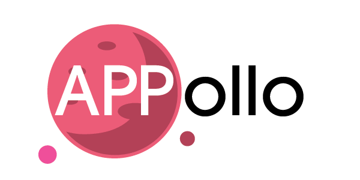

# appollo

<!--
*** Thanks for checking out the Best-README-Template. If you have a suggestion
*** that would make this better, please fork the repo and create a pull request
*** or simply open an issue with the tag "enhancement".
*** Don't forget to give the project a star!
*** Thanks again! Now go create something AMAZING! :D
-->

<!-- PROJECT SHIELDS -->
<!--
*** I'm using markdown "reference style" links for readability.
*** Reference links are enclosed in brackets [ ] instead of parentheses ( ).
*** See the bottom of this document for the declaration of the reference variables
*** for contributors-url, forks-url, etc. This is an optional, concise syntax you may use.
*** https://www.markdownguide.org/basic-syntax/#reference-style-links
-->

<!-- PROJECT LOGO -->
 

  

  <h3 align="center">{APP}ollo</h3>

  

    An awesome site to for people of all ages to learn more about our solar system in a fun way!
     
  

<!-- TABLE OF CONTENTS -->

  
Table of Contents

  <ol>
    <li>
      <a href="#about-the-project">About The Project</a>
      <ul>
        <li><a href="#built-with">Built With</a></li>
      </ul>
    </li>
    <li>
      <a href="#getting-started">Getting Started</a>
      <ul>
        <li><a href="#prerequisites">Prerequisites</a></li>
        <li><a href="#installation">Installation</a></li>
      </ul>
    </li>
    <li><a href="#usage">Usage</a></li>
    <li><a href="#roadmap">Roadmap</a></li>
    <li><a href="#contributing">Contributing</a></li>
    <li><a href="#license">License</a></li>
    <li><a href="#contact">Contact</a></li>
    <li><a href="#acknowledgments">Acknowledgments</a></li>
  </ol>

<!-- ABOUT THE PROJECT -->
## About The Project

Our website aims to provide free, hands-on, experiential learning resources geared towards 3 different levels of experience: beginner, intermediate and advanced. Additionally, users of all abilities should be able to navigate and access the information they need. Users are provided with a combination of links to resources, internship opportunities, books, games, videos, and popular social media accounts that promote the work and love of science. 

Check out our deck to learn more:

<a href="https://www.canva.com/design/DAFN6rPwkcs/Yf1HwORCgRifMuxgwxM8pw/edit?utm_content=DAFN6rPwkcs&utm_campaign=designshare&utm_medium=link2&utm_source=sharebutton">APPollo Deck</a>

(<a href="#top">back to top</a>)

### Built With

This was built with the following. If we had more time we would incorporate a backend with Node.js in order to allow users to sign in. We might also extend it by using React Native to create an app:

* [Bootstrap](https://getbootstrap.com)
* [HTML](https://html.com)
* [CSS](https://css-tricks.com)
* [FIGMA](https://figma.com)

<a href="https://www.figma.com/file/G4vOb2yJlgHXEVbxnrcnh0/NASA-Space-Apps?node-id=35%3A165">Link to our FIGMA Wireframes</a>

(<a href="#top">back to top</a>)

<!-- GETTING STARTED -->
## Getting Started

Coming soon!

### Prerequisites

Coming soon!

### Installation

Coming soon!

(<a href="#top">back to top</a>)

<!-- USAGE EXAMPLES -->
## Usage

Coming soon!

(<a href="#top">back to top</a>)

<!-- ROADMAP -->
## Roadmap

Coming soon!

(<a href="#top">back to top</a>)

<!-- CONTRIBUTING -->
## Contributing

Coming soon!

(<a href="#top">back to top</a>)

<!-- LICENSE -->
## License

Coming soon!

(<a href="#top">back to top</a>)

<!-- CONTACT -->
## Contact

Developed with 💜 by...

* [Cindy Cruz]()
* [Nhu Huynh]()
* [Angel Pichardo](https://www.linkedin.com/in/angel-pichardo-598171215/)
* [Samantha Tarrice](https://www.linkedin.com/in/starrice/)

(<a href="#top">back to top</a>)

<!-- ACKNOWLEDGMENTS -->
## Acknowledgments

Use this space to list resources you find helpful and would like to give credit to. I've included a few of my favorites to kick things off!
* [Notion](https://www.notion.so/83cc03f7c2134bffaa39320dba038d6d?v=ec5843ef4d17439f8be789990d812c4e)
* [Shutterstock](https://www.shutterstock.com/)
* [Vecteezy](https://www.vecteezy.com/)
* [NASA Images](https://www.nasa.gov/multimedia/imagegallery/index.html)
* [GitHub Pages](https://pages.github.com)

(<a href="#top">back to top</a>)

<!-- MARKDOWN LINKS & IMAGES -->
<!-- https://www.markdownguide.org/basic-syntax/#reference-style-links -->
[contributors-shield]: https://img.shields.io/github/contributors/othneildrew/Best-README-Template.svg?style=for-the-badge
[contributors-url]: https://github.com/othneildrew/Best-README-Template/graphs/contributors
[forks-shield]: https://img.shields.io/github/forks/othneildrew/Best-README-Template.svg?style=for-the-badge
[forks-url]: https://github.com/othneildrew/Best-README-Template/network/members
[stars-shield]: https://img.shields.io/github/stars/othneildrew/Best-README-Template.svg?style=for-the-badge
[stars-url]: https://github.com/othneildrew/Best-README-Template/stargazers
[issues-shield]: https://img.shields.io/github/issues/othneildrew/Best-README-Template.svg?style=for-the-badge
[issues-url]: https://github.com/othneildrew/Best-README-Template/issues
[license-shield]: https://img.shields.io/github/license/othneildrew/Best-README-Template.svg?style=for-the-badge
[license-url]: https://github.com/othneildrew/Best-README-Template/blob/master/LICENSE.txt
[linkedin-shield]: https://img.shields.io/badge/-LinkedIn-black.svg?style=for-the-badge&logo=linkedin&colorB=555
[linkedin-url]: https://linkedin.com/in/othneildrew
[product-screenshot]: images/screenshot.png
